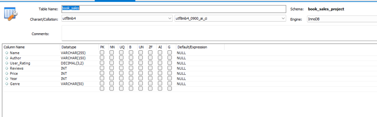

# Book Sales Analysis Using SQL

## Project Overview

This project explores a dataset of Amazon bestselling books from 2009 to 2019 using MySQL. 
The aim was to practise basic SQL skills by answering a range of questions about books, authors, prices, reviews and genres. 
This project helped me gain confidence in writing SQL queries and working with real-world data.

## Dataset

The dataset contains information about Amazon's bestselling books, including:

- Book title
- Author
- User rating
- Number of reviews
- Price
- Year of publication
- Genre

## Database Schema

The project uses a single table called `book_sales`. The table stores information about Amazon bestselling books, including the book title, author, user rating, number of reviews, price, year and genre.

## SQL Skills Used

Throughout this project, I used the following SQL concepts:

- SELECT
- WHERE
- ORDER BY
- GROUP BY
- HAVING
- COUNT()
- SUM()
- AVG()
- LIMIT

## Questions Answered

Some of the questions I answered include:

- Which books have the highest user ratings?
- Which books have the most reviews?
- What is the average price of a bestselling book?
- Which genre has the most bestselling books?
- Which authors appear most often in the dataset?
- How many bestselling books were published each year?

## What I Learned

This project gave me practical experience with SQL and helped me understand how to retrieve, filter, sort and summarise data. 
It also improved my confidence in using aggregate functions and writing queries to answer business-style questions.

## Sample Results

Below are some examples of the analysis carried out in this project.

- Top 10 authors with the most bestselling books
- Most reviewed books
- Highest-rated books
- Average price by genre

See the `Screenshots` folder for the query results.

## Conclusion

This was my first SQL project and a good introduction to analysing data with SQL. It strengthened my understanding of the basics and prepared me for working on more advanced SQL projects in the future.
